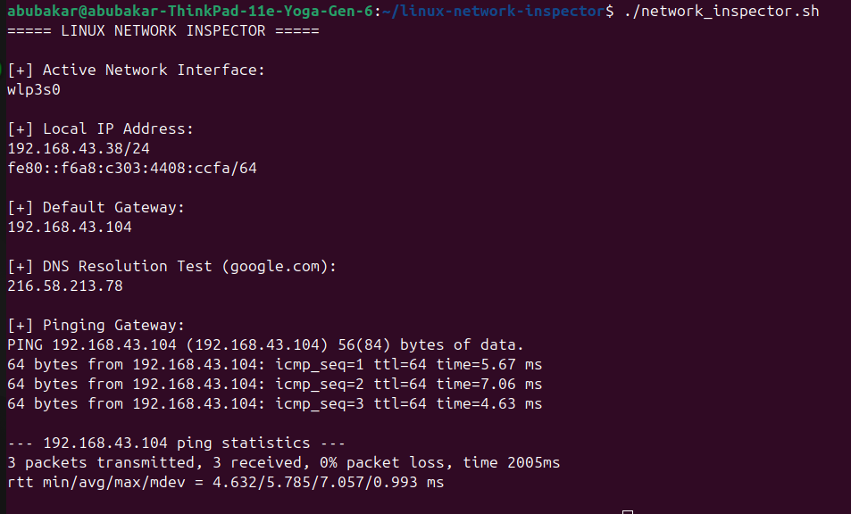

# Linux Network Inspector 

A simple **Bash script** to check your network configuration and connectivity on Ubuntu Linux.  
This is a **beginner-friendly tool** for learning Linux networking and cybersecurity basics.

---

##  Idea Behind the Project

Imagine you are a **security guard** or **network admin**:  
- Before starting your work, you check **who is connected**, **which door you are using**, and **if your systems are reachable**.  
- That’s exactly what this script does: it inspects your network **interfaces, IP addresses, gateway, DNS, and connectivity**.

This project is inspired by **real-world networking checks** that security professionals do before doing any **ethical hacking, network scanning, or server monitoring**.

---

##  What the Script Does

1. Shows **active network interface** (like Wi-Fi or wired)  
2. Shows **local IP address** of your machine  
3. Shows **default gateway IP** (your router or internet exit)  
4. Tests **DNS resolution** (e.g., google.com)  
5. Pings the **gateway** to check connectivity  

> Each step is designed to give **real networking insight**, useful for **ethical hackers, SOC analysts, or Linux admins**.

---

## Screenshot




##  How to Run

1. Clone the repository:
```bash
git clone https://github.com/abumilo99/linux-network-inspector.git
cd linux-network-inspector
